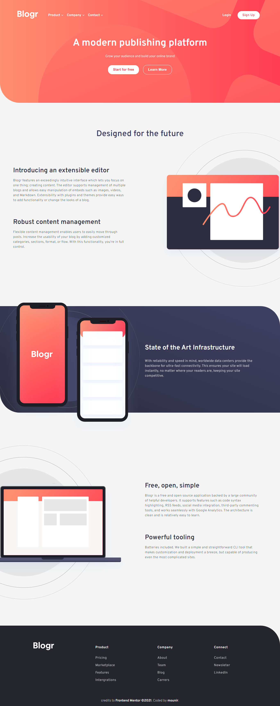
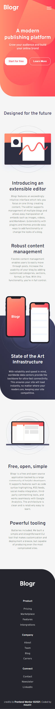

# Frontend Mentor - Blogr landing page solution

This is a solution to the [Blogr landing page challenge on Frontend Mentor](https://www.frontendmentor.io/challenges/blogr-landing-page-EX2RLAApP). Frontend Mentor challenges help you improve your coding skills by building realistic projects. 

## Welcome! 👋

[Frontend Mentor](https://www.frontendmentor.io) challenges help you improve your coding skills by building realistic projects.

This is a solution to the [Blogr landing page challenge on Frontend Mentor](https://www.frontendmentor.io/challenges/blogr-landing-page-EX2RLAApP). Frontend Mentor challenges help you improve your coding skills by building realistic projects. 
## Table of contents

- [Frontend Mentor - Blogr landing page solution](#frontend-mentor---blogr-landing-page-solution)
  - [Welcome! 👋](#welcome-)
  - [Table of contents](#table-of-contents)
  - [Overview](#overview)
    - [The challenge](#the-challenge)
    - [Screenshots](#screenshots)
    - [Links](#links)
    - [Built with](#built-with)
    - [Continued development](#continued-development)
  - [Author](#author)

## Overview

### The challenge

Users should be able to:
- View the optimal layout for the site depending on their device's screen size
- See hover states for all interactive elements on the page

### Screenshots

 
 

### Links
- Page preview : https://blogr-landing-main.netlify.app/

### Built with

- Semantic HTML5 markup
- More practice with SCSS
- Flexbox

### Continued development

- It was a greate projeect to pracrtice my SCSS skills

## Author

- Github [@mounir-m4](https://github.com/mounir-m4)
- Twitter - [@mounirmotawakil](https://twitter.com/mounirmotawakil)
- Frontend Mentor - [@mounir-m4](https://www.frontendmentor.io/profile/mounir-m4)